# ThingPark X Loction Engine Network Interface Trnslator setup guide

The ThingPark X Loction Engine Network Interface Trnslator (TPXLE-NIT) can be used with Abeeway devices connected through Helium and TTN networks.
An instance of this interface translator is already hosted at Actility cloud and can be tested to connect Abeeway Devices to the [Abeeway Device Manager][3] application.
The following steps explain how to set up this connectivity.

1. [Sing up][1] for a new ThingPark Community account.
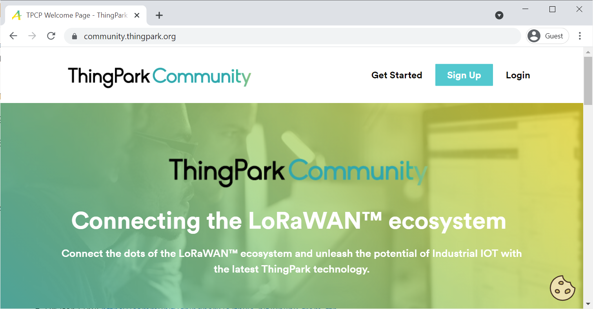

2. Sign in with your new account to the [ThingPark Community Console][2].
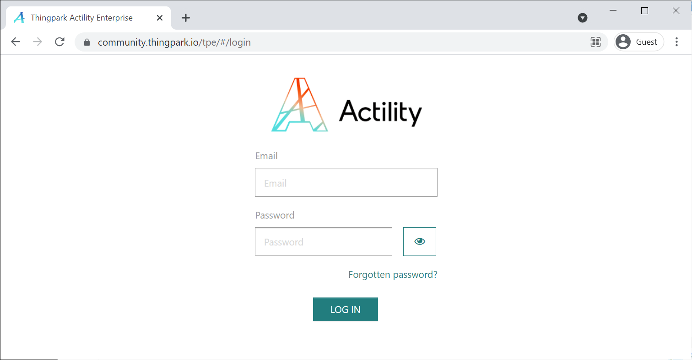

3. Create a fake application
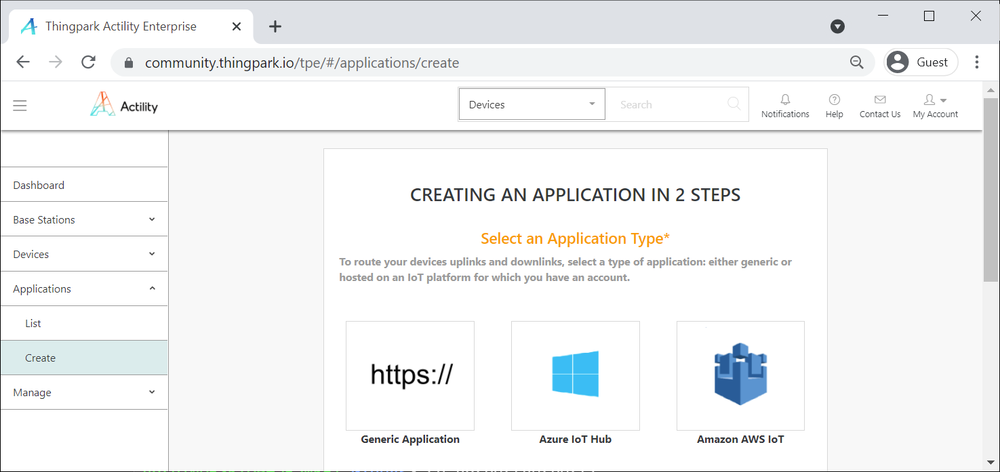
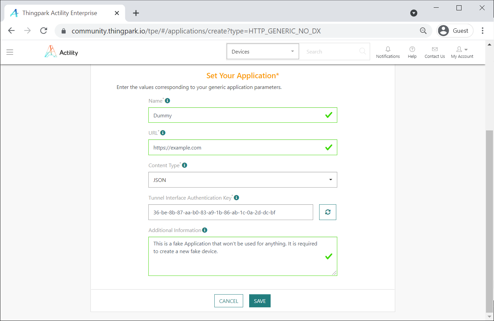

4. Provision your Abeeway Trackers on the ThingPark Community Console.   
Since you are planning to use a 3rd party network server, you dont have to provision your devices with the correct AppSKey and AppEUI. We recommend you using "00000000000000000000000000000000" as ApppSKey and 0000000000000000 as JounEUI. The only important data you need to be accurate with is the DevEUI so that our platform can assign your device to your account.
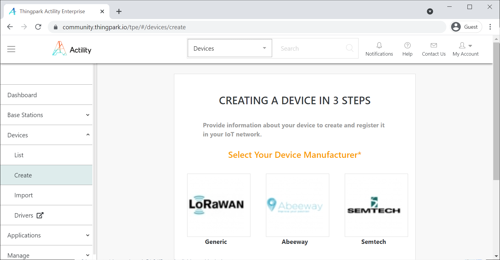
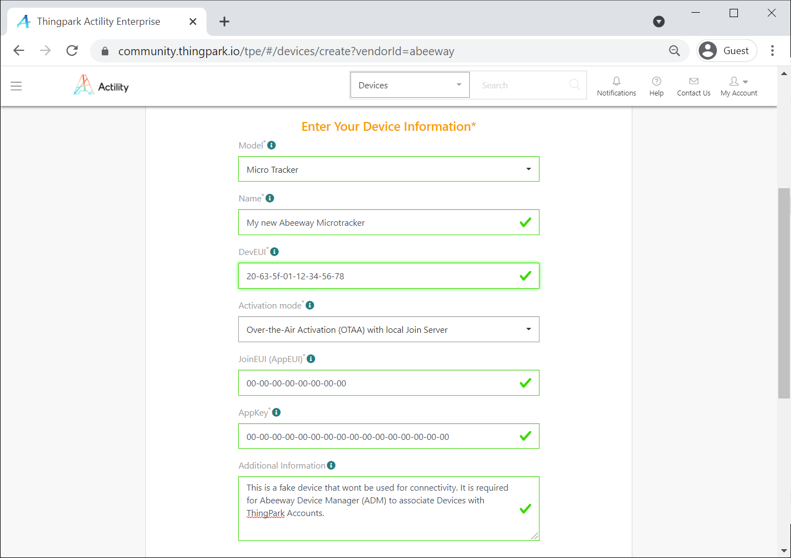
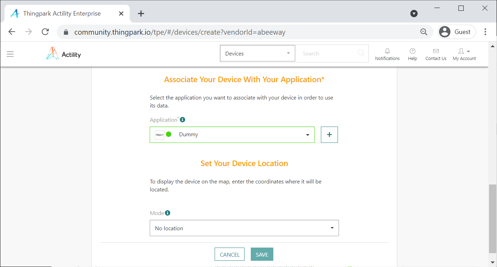

4. Create a new HTTP (webhook) integration on the Helium/TTN Console with the following parameters:
    - [Helium Console][4]: 
      - Url (for Helium): https://community.thingpark.io/tpxle-nit/uplink_from_helium
      - Header: "x-client-id: community-api/*<YOUR_THINGPARK_COMMUNITY_USER_ID>*"
      - Header: "x-client-secret: *<YOUR_THINGPARK_COMMUNITY_PASSWORD>*"
    - [TTN Console][5]: 
      - Url (for TTN): https://community.thingpark.io/tpxle-nit/uplink_from_ttn
      - Header: "x-client-id: community-api/*<YOUR_THINGPARK_COMMUNITY_USER_ID>*"
      - Header: "x-client-secret: *<YOUR_THINGPARK_COMMUNITY_PASSWORD>*"
 
5. Configure the ThingPark X Location Engine (TPX LE) Binder Module through the DX Location API so that tracker commands are forwarded to the right connector module:
    - Log in to [ThingPark DX API][6] with your ThingPark Community Credentials.
    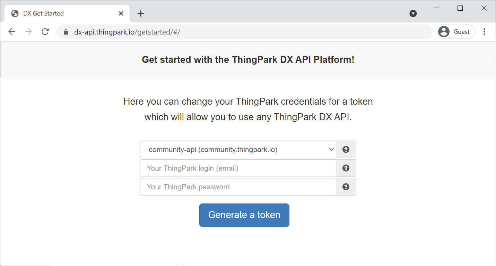
    - Click on *DX Location API > Swagger UI*
    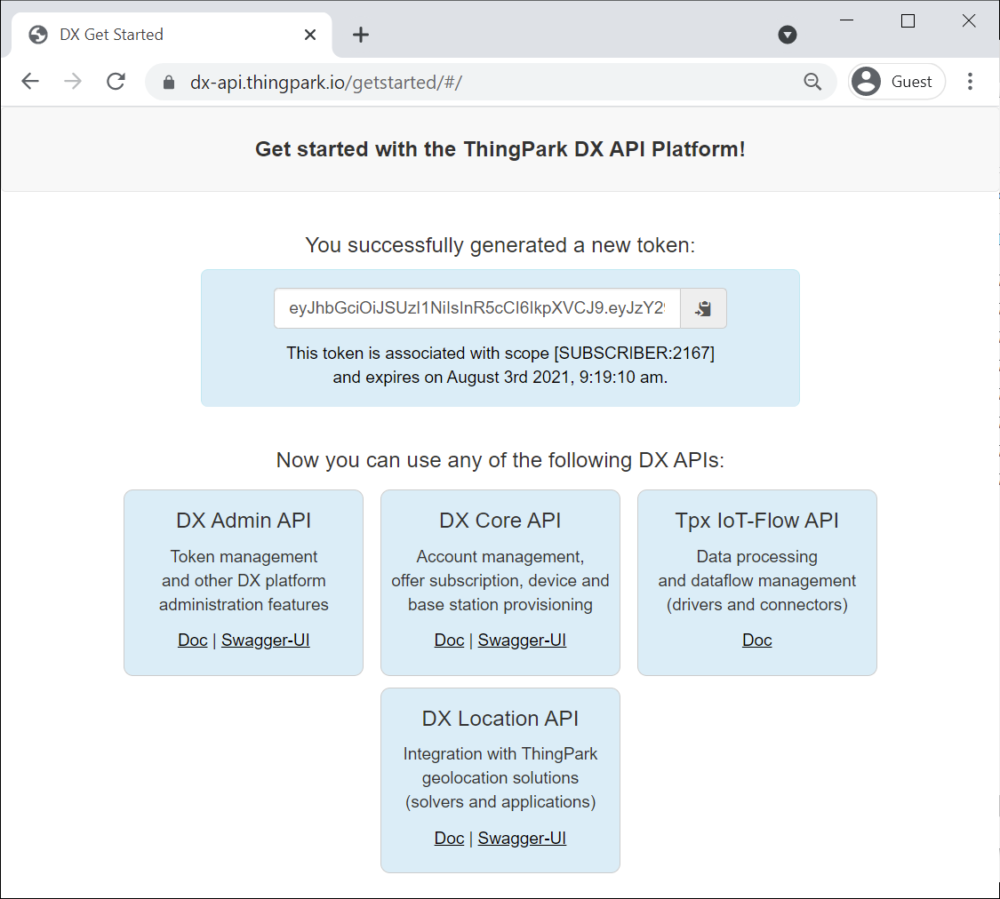
    - Under the *BinderConfig* title click on *POST /binderConfigs*
    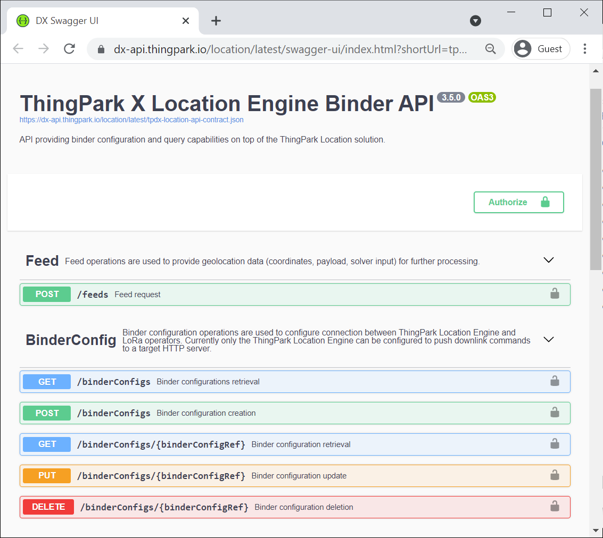  
    - Click on the *Try it out* button.
    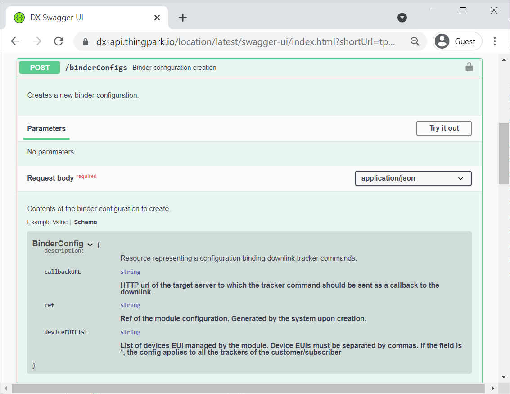 
    - Insert the following text into the textarea:
      - for Helium:
        ```
        {
          "deviceEUIList": "*",
          "callbackURL": "https://community.thingpark.io/tpxle-nit/downlink_to_helium"
        }
        ```
      - for TTN:
        ```
        {
          "deviceEUIList": "*",
          "callbackURL": "https://community.thingpark.io/tpxle-nit/downlink_to_ttn"
        }
        ```
      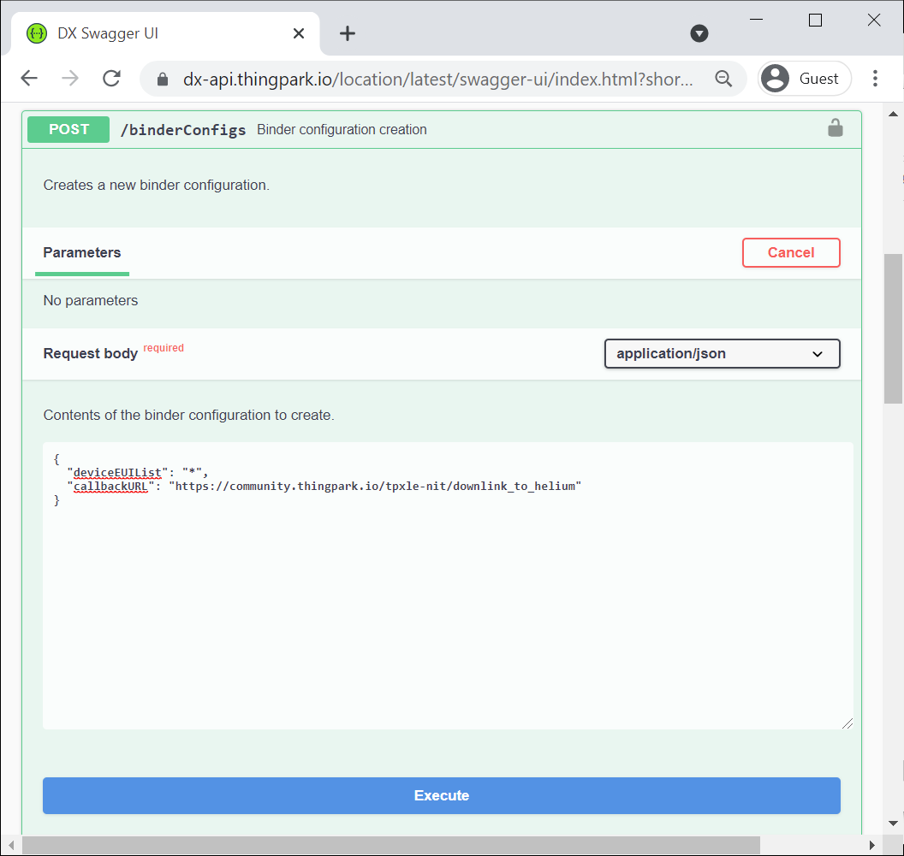
    - Click on the *Execute* button under the text area.  

6. Test the uplink integration:
    - Wait until the tracker sends a few UL messages.
    - Verify on Helium/TTN Console that UL messages are forwarded to the integration you created earlier.
    - Login to [Abeeway Device Manager (ADM)][3] with your ThingPark Community Credentials, select your devices and find your trackers on the map.
      - If you cannot see any devices in the list after you logged, in then you trackers has not sent any messages to ADM yet.

7. Test the downlinlink integration:
    - Login to [Abeeway Device Manager (ADM)][3] with your ThingPark Community Credentials and select your devices.
    - Click on the *Device Configuration* tab at the top of the ADM GUI.
    - Click on the drop-dowm menu item at the bottom left of the page and select the *Start SOS mode* option.
    - Click on the *Send Request* button just at the right of the drop-down menu item.  
     This should generate a downlink command that will switch the tracker to SOS mode. 

[1]: https://community.thingpark.org/
[2]: https://community.thingpark.io/
[3]: https://dev1.thingpark.com/thingpark/abeewayDeviceAnalyzer/index.php?dxprofile=community
[4]: https://console.helium.com/welcome
[5]: https://console.cloud.thethings.network/
[6]: https://dx-api.thingpark.io/getstarted/#/

